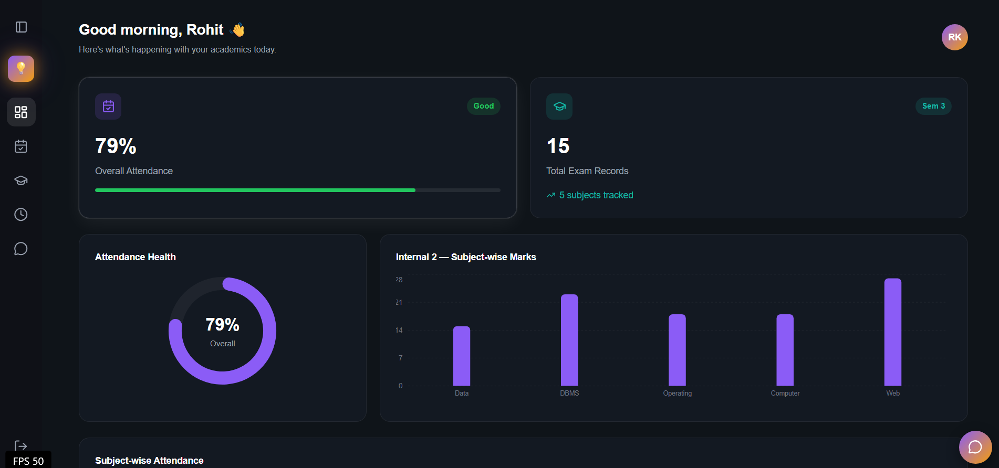
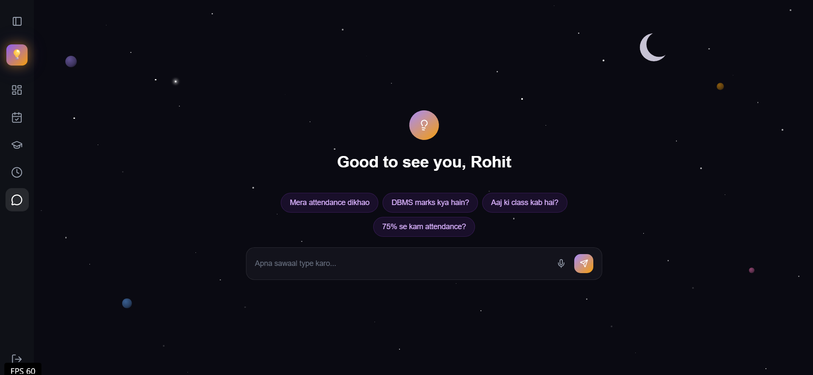
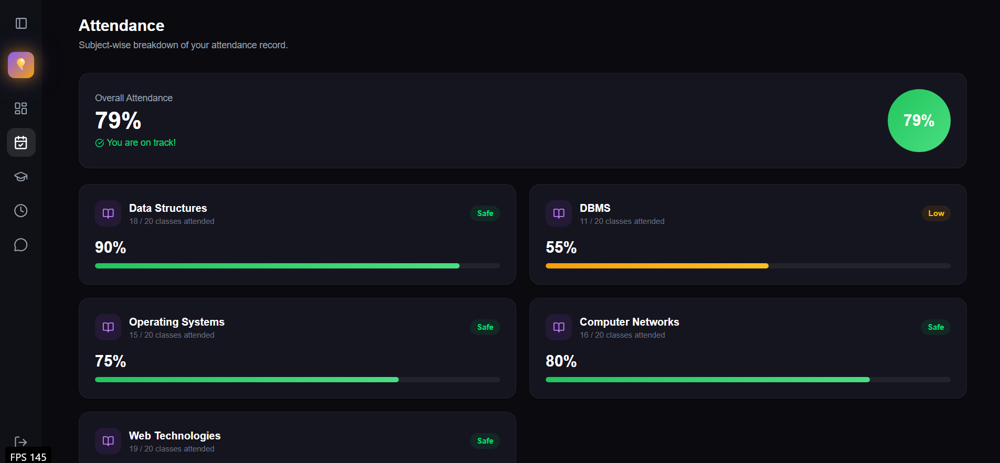
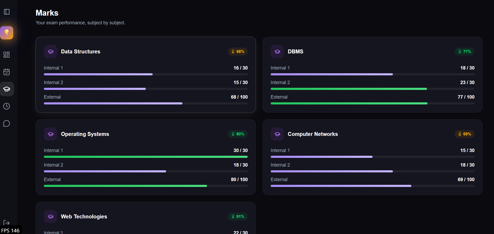
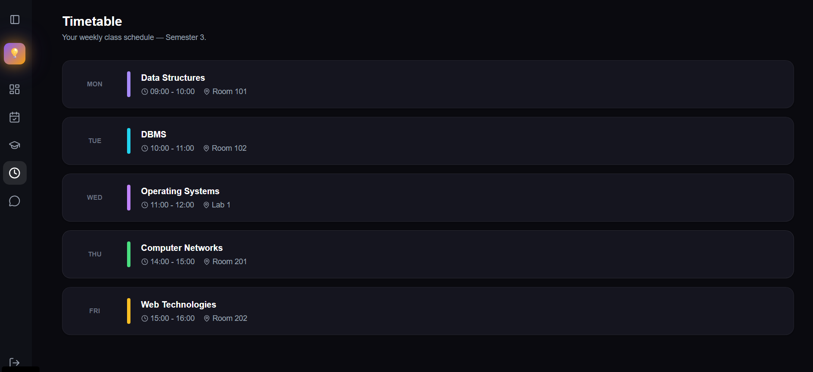
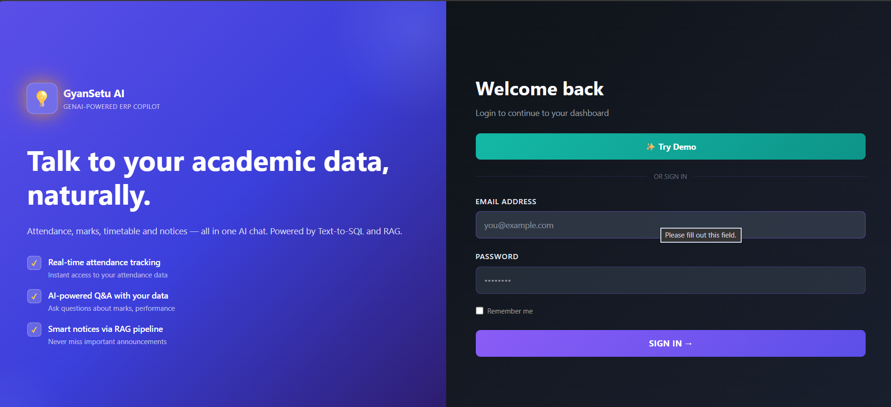

<!-- <div align="center">

# 💡 EduPilot AI

### GenAI-powered ERP Copilot for Students

Talk to your academic data, naturally.

[](https://EduPilot-ai-obxu.vercel.app)
[](https://nextjs.org/)
[](https://fastapi.tiangolo.com/)
[](https://supabase.com/)

[Live App](https://EduPilot-ai-obxu.vercel.app) · [Report Bug](../../issues) · [Request Feature](../../issues)

</div>

---

## 📖 About

**EduPilot AI** reimagines the typical student dashboard by adding a conversational AI layer on top of academic data. Instead of clicking through menus to find attendance, marks, or class timings, students can simply _ask_ — in plain English — and get instant, accurate answers powered by a **Text-to-SQL + RAG pipeline**.

Built as a full-stack project to demonstrate real-world skills: authentication, live data fetching, responsive UI design, and integrating LLMs with structured data.

## ✨ Features

- 📊 **Interactive Dashboard** — at-a-glance view of attendance %, exam records, and subject performance with animated charts
- 📅 **Attendance Tracker** — subject-wise breakdown with safe/low status indicators
- 📈 **Marks & Grades** — Internal 1, Internal 2, and External marks per subject, visualized with progress bars
- 🗓️ **Timetable** — weekly class schedule with "today's class" highlighting
- 🤖 **AI Chat Assistant** — ask questions about your academic data in natural language (e.g. _"What's my DBMS attendance?"_), answered via a Text-to-SQL + RAG pipeline
- 🎙️ **Voice Input** — speak your questions to the AI chat using the Web Speech API
- 🔐 **Secure Auth** — JWT-based login, with a one-click **"Try Demo"** button for recruiters (no credentials needed)
- 🌗 **Polished Dark UI** — custom dark theme with neon glow accents, fully responsive across desktop and mobile

## 🛠️ Tech Stack

| Layer        | Technology                                                              |
| ------------ | ----------------------------------------------------------------------- |
| **Frontend** | Next.js (App Router), TypeScript, Tailwind CSS, Framer Motion, Recharts |
| **Backend**  | FastAPI (Python)                                                        |
| **Database** | Supabase (PostgreSQL)                                                   |
| **AI / LLM** | Llama 3.1 8B (via Groq) — Text-to-SQL + RAG pipeline                    |
| **Auth**     | JWT                                                                     |
| **Voice**    | Web Speech API                                                          |
| **Hosting**  | Vercel (frontend) · Railway (backend)                                   |

## 🚀 Live Demo

|                  |                                                                    |
| ---------------- | ------------------------------------------------------------------ |
| **App**          | [EduPilot-ai-obxu.vercel.app](https://EduPilot-ai-obxu.vercel.app) |
| **API**          | [EduPilot-ai-production.up.railway.app](http://localhost:8000)     |
| **Quick access** | Click **"Try Demo"** on the login page — no signup needed          |

> **Note:** The backend runs on a free-tier server, which goes to sleep after inactivity. The first request after a while may take 5–10 seconds while the server wakes up — the UI shows a loading message during this time.

## 📸 Screenshots

<p align="center">
  <br/>
  <em>Dashboard — attendance health, marks overview, and subject breakdown</em>
</p>

<p align="center">
  <br/>
  <em>AI Chat — ask questions about your academic data in natural language</em>
</p>

<p align="center">
  <br/>
  <em>Attendance — subject-wise breakdown with safe/low indicators</em>
</p>

<p align="center">
  <br/>
  <em>Marks — Internal 1, Internal 2, and External scores per subject</em>
</p>

<p align="center">
  <br/>
  <em>Timetable — weekly class schedule</em>
</p>

<p align="center">
  <br/>
  <em>Login — one-click demo access for recruiters</em>
</p>

## 🧠 How the AI Chat Works

1. User asks a question in natural language (typed or spoken)
2. The query is interpreted and converted into a structured SQL query against the student's academic data (**Text-to-SQL**)
3. Relevant context (notices, FAQs) is retrieved via a **RAG (Retrieval-Augmented Generation)** pipeline where needed
4. The LLM (**Llama 3.1 8B**, via Groq) generates a natural-language response grounded in the retrieved data

## 🏗️ Project Structure

```
EduPilot-ai/
├── frontend/              # Next.js app
│   └── app/
│       ├── dashboard/
│       ├── attendance/
│       ├── marks/
│       ├── timetable/
│       ├── chat/
│       └── login/
├── backend/                # FastAPI app
│   ├── auth/
│   ├── routes/
│   └── ...
└── README.md
```

## ⚙️ Getting Started Locally

### Prerequisites

- Node.js 18+
- Python 3.10+
- A Supabase project (PostgreSQL)
- A Groq API key (free at [console.groq.com](https://console.groq.com))

### Frontend

```bash
cd frontend
npm install
npm run dev
```

### Backend

```bash
cd backend
pip install -r requirements.txt
uvicorn main:app --reload
```

Create a `.env` file in `backend/` with your Supabase and Groq credentials.

## 📬 Connect

Built by **Rohit Raj** — feel free to reach out or open an issue if you spot something! -->


# EduPilot AI

AI-powered Academic ERP Platform for Students and Faculty

------------------------------------------------------------

✨ Features

Student Portal

• Attendance Analytics
• Marks Dashboard
• Timetable
• Academic Calendar
• Notices
• AI Academic Assistant
• Voice Search
• Notifications
• Profile Management

Faculty Portal

• Subject Dashboard
• Attendance Management
• Marks Entry
• Schedule Classes
• Publish Notices
• Student Roster
• Academic Progress Tracking

AI Features

• Natural Language Queries
• Text-to-SQL
• Retrieval-Augmented Generation
• Voice Input
• Context-aware Responses

------------------------------------------------------------

Architecture

Next.js
        ↓
FastAPI REST API
        ↓
PostgreSQL (Supabase)
        ↓
Llama 3 via Groq

------------------------------------------------------------

Tech Stack

Frontend

• Next.js 15
• TypeScript
• Tailwind CSS
• Framer Motion
• Recharts

Backend

• FastAPI
• SQLAlchemy
• JWT Authentication
• PostgreSQL
• REST API

Database

• PostgreSQL
• Supabase

AI

• Llama 3.1
• Groq API
• Text-to-SQL
• RAG

------------------------------------------------------------

Core Modules

Student

✓ Dashboard
✓ Attendance
✓ Marks
✓ Timetable
✓ Calendar
✓ Notices
✓ Notifications
✓ AI Chat

Faculty

✓ Dashboard
✓ Attendance
✓ Marks
✓ Timetable
✓ Notices
✓ Student Management

------------------------------------------------------------

Authentication

• JWT
• Role-based Access
• Demo Login

------------------------------------------------------------

Project Structure

frontend/
backend/
database/
screenshots/

------------------------------------------------------------

Installation

Frontend

npm install
npm run dev

Backend

pip install -r requirements.txt
uvicorn app.main:app --reload

------------------------------------------------------------

Future Improvements

• Admin Portal
• Parent Dashboard
• AI Performance Prediction
• Assignment Submission
• Email Notifications
• Mobile App